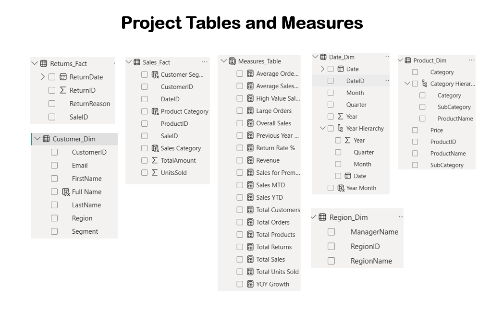

# 📊 Sales & Customer Intelligence Dashboard

## 🎯 Project Overview

The Sales & Customer Intelligence Dashboard is an end-to-end Power BI project designed to transform raw sales and customer data into actionable business insights.

The project demonstrates the complete Business Intelligence workflow, including:

- Data Cleaning & Transformation using Power Query
- Star Schema Data Modeling
- Relationship Management
- DAX Measures & Calculated Columns
- Time Intelligence Analysis
- Customer Segmentation
- Product Performance Analysis
- Returns & Quality Monitoring
- Interactive Dashboard Design

The objective is to help business stakeholders monitor sales performance, understand customer behavior, evaluate product contribution, and identify return-related quality issues through a visually interactive dashboard.

---

## 🛠 Tools & Technologies Used

- Power BI Desktop
- Power Query
- DAX (Data Analysis Expressions)
- Star Schema Modeling
- Data Visualization
- Time Intelligence Functions

---

## 📂 Data Model Architecture

A Star Schema model was implemented to improve performance and simplify analytical reporting.

### Fact Tables

- Sales_Fact
- Returns_Fact

### Dimension Tables

- Customer_Dim
- Product_Dim
- Region_Dim
- Date_Dim

### Additional Table

- Measures_Table

---

## ⭐ Star Schema Design

The data model follows a centralized fact table structure connected to multiple dimension tables.

### Model Benefits

- Faster query performance
- Better scalability
- Simplified relationships
- Efficient DAX calculations

### Screenshot

.png)

---

## 📋 Project Tables & Measures

The project includes dedicated dimension tables, fact tables, and a separate measures table for improved organization.

### Screenshot

---

## 📈 DAX Calculations Implemented

### Measures

- Total Sales
- Revenue
- Total Orders
- Total Customers
- Total Products
- Total Returns
- Total Units Sold
- Average Order Value
- Return Rate %
- Sales for Premium Customers
- Large Orders
- Average Sales Amount

### Filter Context Functions

- CALCULATE()
- FILTER()
- ALL()

### Time Intelligence Functions

- TOTALYTD()
- TOTALMTD()
- SAMEPERIODLASTYEAR()

### Calculated Columns

- Full Name
- Year Month
- Sales Category
- Customer Segment
- Product Category

### Screenshot

.jpg)

---

# 📄 Dashboard Pages

---

## 1️⃣ Executive Overview Dashboard

This page provides a high-level summary of business performance.

### Key Metrics

- Total Sales
- Total Customers
- Total Orders
- Returned Orders
- Return Rate %

### Visuals

- KPI Cards
- Gauge Chart
- Donut Chart
- Line Chart
- Revenue by Customer Segment
- Interactive Slicers

### Business Value

Provides executives with a quick understanding of revenue performance, customer growth, and return trends.

### Screenshot

---

## 2️⃣ Customer Analytics Dashboard

This page focuses on customer segmentation and purchasing behavior.

### Key Metrics

- Average Order Value
- Total Customers

### Visuals

- Top Revenue Generating Customers
- Revenue Contribution by Segment
- Regional Sales Contribution
- Decomposition Tree
- Interactive Filters

### Business Value

Helps identify high-value customers, customer segments, and revenue-driving regions.

### Screenshot

---

## 3️⃣ Product Performance Dashboard

This page evaluates category-level and product-level performance.

### Key Metrics

- Revenue
- Units Sold
- Total Products

### Visuals

- Waterfall Chart
- Revenue Matrix
- Category Revenue Trend
- Product Insights
- Category & Subcategory Filters

### Business Value

Supports inventory planning, category evaluation, and product optimization decisions.

### Screenshot

---

## 4️⃣ Returns & Quality Analysis Dashboard

This page analyzes return trends and quality-related issues.

### Key Metrics

- Returned Orders
- Return Rate %
- High Value Sales

### Visuals

- Return Reason Analysis
- Donut Chart
- Waterfall Chart
- Decomposition Tree
- Root Cause Analysis

### Business Value

Helps identify major return drivers, monitor product quality, and improve customer satisfaction.

### Screenshot

---

## 🔍 Key Insights Generated

- Generated total revenue of **844K+** across all transactions.
- Maintained a low overall return rate of **5%**.
- Identified top revenue-generating customers.
- Evaluated category-wise product performance.
- Analyzed regional sales contribution.
- Tracked return reasons and quality-related issues.
- Applied Time Intelligence functions for performance tracking.

---

## 🚀 Skills Demonstrated

### Power Query
- Data Cleaning
- Data Transformation
- Data Preparation

### Data Modeling
- Star Schema
- Relationship Management

### DAX
- Measures
- Calculated Columns
- Filter Context
- Time Intelligence

### Data Visualization
- KPI Cards
- Gauge Charts
- Donut Charts
- Treemaps
- Waterfall Charts
- Decomposition Trees
- Matrix Reports

### Business Intelligence
- Customer Analytics
- Product Analytics
- Sales Monitoring
- Return Analysis

---

## 📌 Project Outcome

This dashboard transforms raw transactional data into meaningful business intelligence, enabling data-driven decision making through interactive reporting, advanced DAX calculations, and professional dashboard design.
